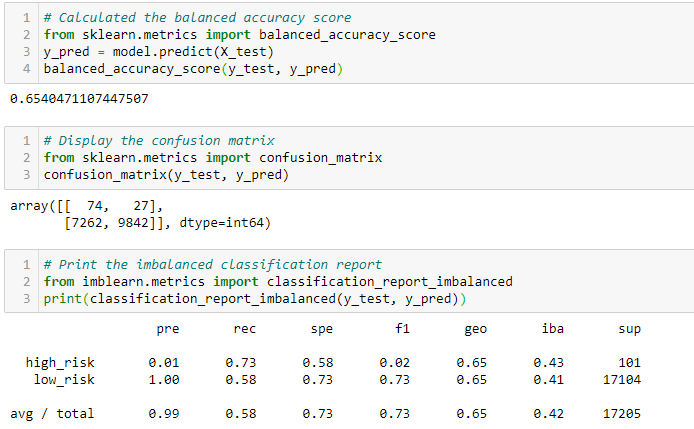
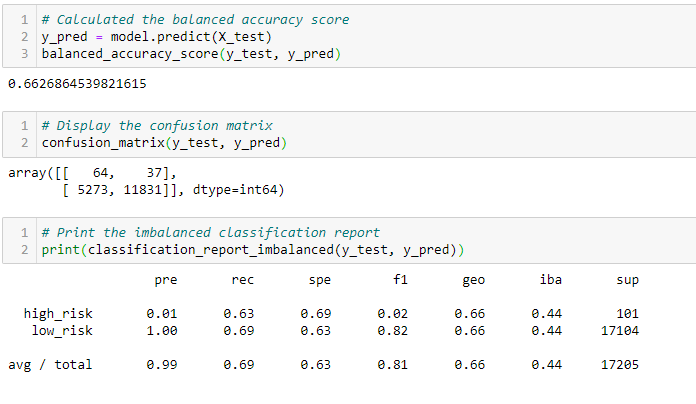
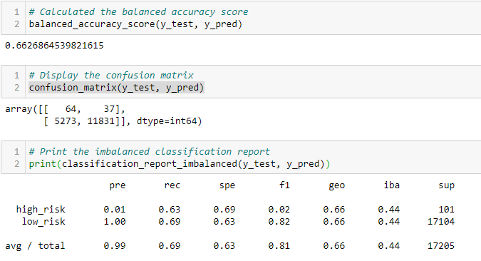
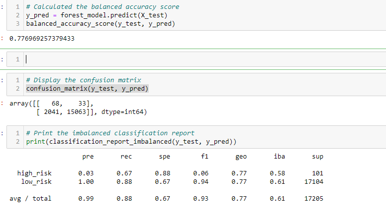

# Credit_Risk_Analysis

# Overview of the loan prediction risk analysis:
We were tasked to use the credit card credit dataset from LendingClub, a peer-to-peer lending services company, to oversample the data using the RandomOverSampler and SMOTE algorithms, and undersample the data using the ClusterCentroids algorithm. Then, we used a combinatorial approach of over- and undersampling using the SMOTEENN algorithm. Next, we compared two new machine learning models that reduce bias, BalancedRandomForestClassifier and EasyEnsembleClassifier, to predict credit risk. Then we evaluated the performance of these models and make a written recommendation on whether they should be used to predict credit risk.

Results:
* Naive Random Oversampling
In this sampling we got the Balanced accuracy score of 0.654047.

* SMOTE Oversampling
In this sampling the Balanced score is 0.6628.

* Undersampling
In this sampling the Balanced score is 0.6627.

* Combination (Over and Under) Sampling
In this Sample we notice that the high_risk was .01 and the low_risk is at 1.00. and and accuracy score of 0.7769

#Summary
For this analysis we captured the accuracy score in order to best asses the loan status. We find that in all our samples the accuracy for finding high_risk applications is not very good. This would not be the best way for use to find out if a loan would be approved or not.  Our best course of action would be for use to rely on the balanced accuracy score of the Ensemble Learners because it had the highest results.
